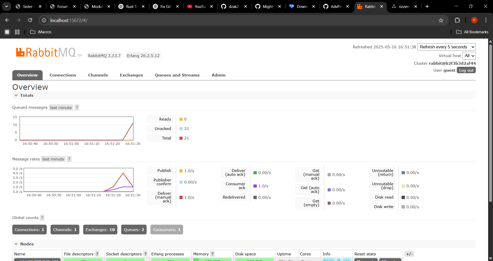
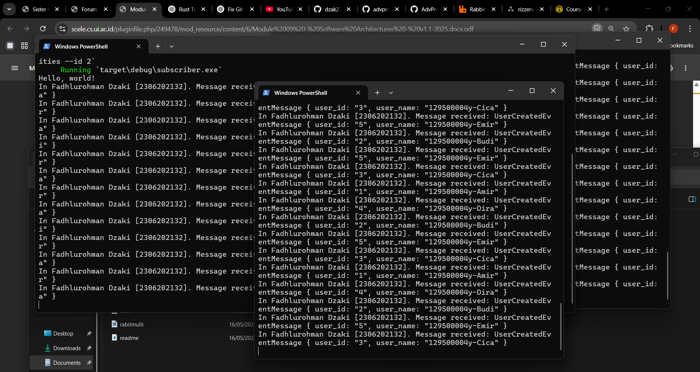
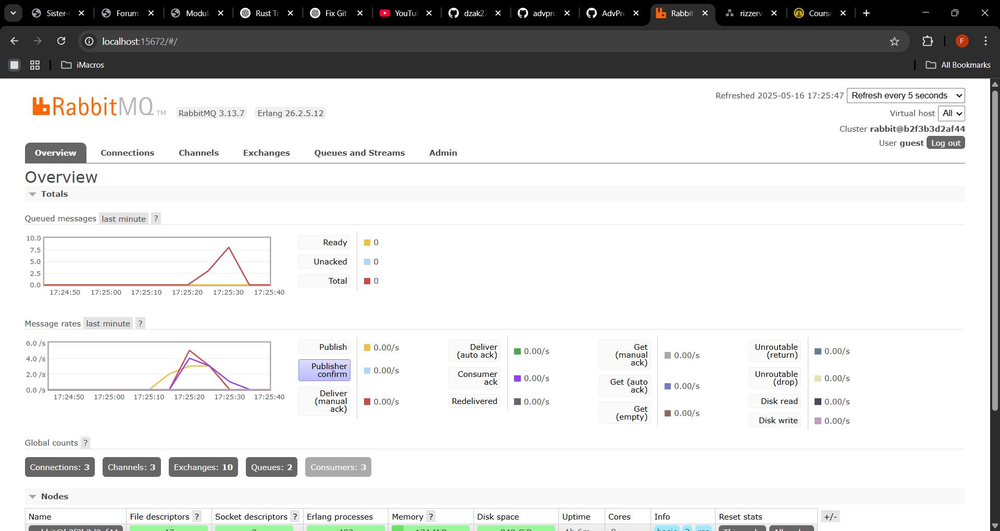

# Subscriber App

## Reflection
> What is `amqp`?

AMQP (Advanced Message Queuing Protocol) adalah sebuah protokol komunikasi open-standard untuk message-oriented middleware. AMQP memungkinkan sistem perangkat lunak yang berbeda untuk berkomunikasi secara asinkron melalui message queue.

AMQP digunakan untuk mengirim, menerima, dan menyimpan pesan antar sistem dengan cara yang aman, andal, dan dapat diskalakan. Salah satu implementasi AMQP yang populer adalah RabbitMQ.

> What does "guest:guest@localhost:5672" means? What is the first "guest", the second "guest", and what is "localhost:5672" for?

String guest:guest@localhost:5672 adalah URI connection string untuk menghubungkan aplikasi dengan server AMQP (misalnya RabbitMQ). Penjelasan bagiannya:

* guest (pertama): adalah username yang digunakan untuk login ke server RabbitMQ.

* guest (kedua): adalah password untuk username tersebut.

* localhost: adalah alamat host tempat RabbitMQ dijalankan. Dalam hal ini, RabbitMQ berjalan secara lokal di komputermu.

* 5672: adalah nomor port default yang digunakan oleh protokol AMQP (port ini digunakan oleh RabbitMQ untuk menerima koneksi dari client).

## Gambar
Gambar tersebut menunjukkan grafik pada bagian atas yang mengalami lonjakan (spike), menggambarkan situasi ketika subscriber lambat dalam memproses pesan. Terlihat bahwa lebih dari 20 pesan sempat menumpuk dalam antrean selama beberapa detik sebelum akhirnya berkurang kembali. Hal ini terjadi karena subscriber membutuhkan waktu sekitar 10 milidetik untuk memproses setiap pesan, sehingga saat publisher mengirim banyak pesan secara bersamaan dalam waktu singkat, antrean sementara terbentuk di RabbitMQ sebelum akhirnya terurai seiring diprosesnya pesan-pesan tersebut.

Gambar yang memperlihatkan 3 program `subscriber` yang menerima *message* dari `publisher` yang dijalankan beberapa kali.

Gambar menunjukkan grafik RabbitMQ di mana antrean pesan (queued messages) tidak mengalami lonjakan seperti saat hanya satu subscriber yang berjalan. Ini disebabkan oleh cara kerja RabbitMQ yang mendistribusikan pesan ke salah satu subscriber saja, bukan ke semua sekaligus. Dengan demikian, saat satu subscriber masih sibuk memproses pesan, RabbitMQ dapat langsung mengirim pesan berikutnya ke subscriber lain yang sudah tersedia atau tidak sedang memproses apapun. Pola distribusi ini juga terlihat pada gambar sebelumnya, di mana masing-masing subscriber menerima pesan dalam urutan yang berbeda.

